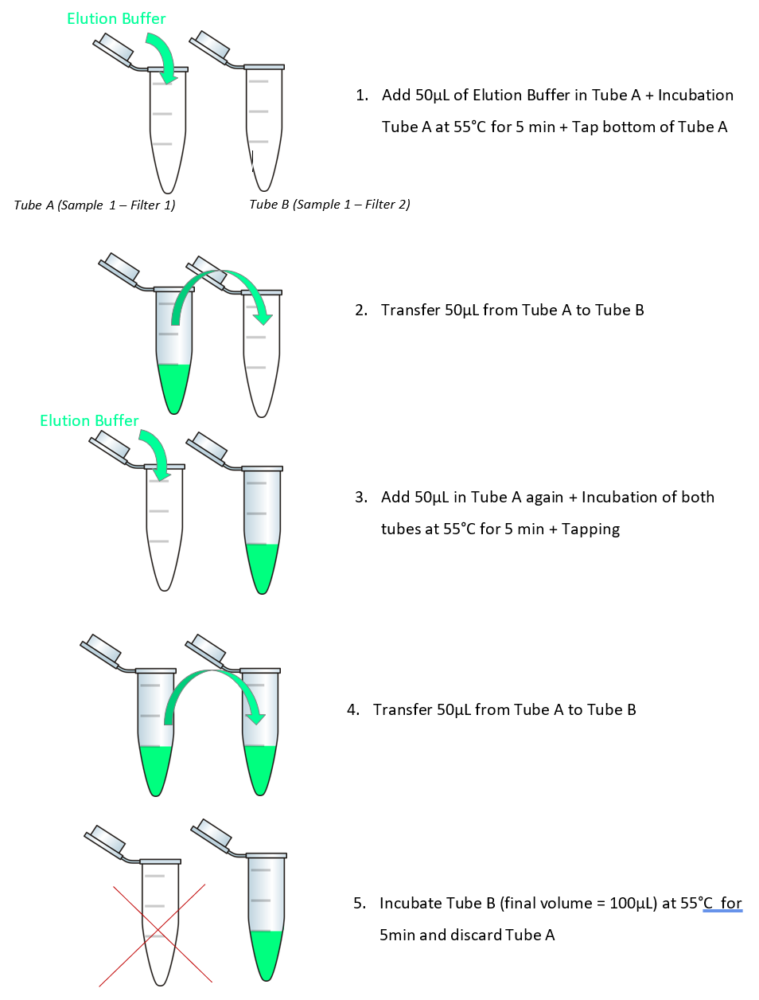

==============================
Useful Protocols and Equipment
==============================

In this section, we will go over some of the protocols, equipment, and kits that we use for eDNA
projects in the Lougheed Lab at Queen’s University. They are based on the literature, what is
commercially available in Canada, and a decade of experience with eDNA projects. They may not be
suitable or ideal for your study. As always, best practice in eDNA studies is to consult the
literature and your colleagues for methods specific to your target taxa, sampling environment, and
research questions, conduct pilot studies to test your methods, and also to report your methods as
rigorously and thoroughly as possible.

Sampling, filtration, and extraction protocols were originally developed by Feng et al. (2019) from
Turner et al. (2014) with considerable correspondence with early users of eDNA during his PhD
thesis. Protocols were further developed by Chen et al. (2023) and Tournayre et al. (2024), and
updated in 2022, 2023, 2024, and 2025 for this workshop. Please note that we have not conducted
rigorous in-lab reviews of different protocols for comparison with ours, although all protocols
described here have been thoroughly tested in our lab.

Sampling and Filtration
=======================

.. raw:: latex

    \begin{landscape}

.. _table_7:
.. csv-table:: Equipment and consumables.
   :file: ../tables/table_7.csv
   :widths: 20 40 40
   :header-rows: 1

.. raw:: latex

    \end{landscape}

Alternative pump models include sample-in-place models such as Smith-Root's eDNA sampler
(https://www.smith-root.com/edna/edna-sampler) and Halltech’s OSMOS eDNA sampler
(http://halltech.ca/dir/products/osmos-edna-sampler/), automated sampler mechanisms such as
Smith-Root’s eDNA Autosampler
(https://www.smith-root.com/services/training/environmental-dna-field-sampling-techniques),
and deep-water samplers such as McLane’s RoCSI or PPS models (https://mclanelabs.com/edna-landing-page/)
and OceanDiagnostics’ eDNA sampler (https://oceandiagnostics.com/environmental-dna-samplers).
In general, pumps should be easy to sterilize (highly resistant to bleach) and have good battery
life for operation in the field.

Other common filter types include Smith-Root’s self preserving filters
(https://www.smith-root.com/edna/edna-filters), enclosed Sterivex filters
(https://www.sigmaaldrich.com/CA/en/product/mm/svgp010), and materials including cellulose nitrate
(CN), polyethylene sulfone (PES), glass microfiber (GMF), and polyvinylidene fluoride (PVDR)
(Majaneva et al. 2018). https://www.nature.com/articles/s41598-018-23052-8#Sec2

Other equipment that may be required for your study include the following:

- Beakers or other waste containers.
- 1.7 mL microcentrifuge tubes with a preservation buffer such as CTAB.
- distilled or ddH2O for cleaning the filtration apparatus between samples (in either a large
  dispenser or individual bottles, bring at least 2L per sample).
- Dilute bleach (10% to 20% household bleach, approximately 0.5% to 1% sodium hypochlorite) for
  cleaning the filtration apparatus between samples and for cleaning waders and other equipment
  between sites.
- Clean gloves and masks that have been stored away from tissue samples or PCR products.
- Stainless steel or single use plastic forceps for handling filters.
- 95% ethanol and lighter for disinfecting forceps through burning.
- Cooler for holding water samples (if they’re filtered off-site).
- Large resealable bags for isolating pre- and post-sampling materials.
- GPS and probes for collecting metadata.
- Bleach spray for cleaning waders.

Equipment Decontamination
=========================

These steps are to be performed shortly before fieldwork (the previous day or the morning of), as
equipment doesn’t stay decontaminated over time.

Prepare 10% bleach (100mL bleach + 1000mL of distilled water)

#. Submerge the following in 10% bleach for at least 30 minutes: pump tubes, filter holder beakers
   and the sampling bottles. Rinse pump tubes, filter holders, and glassware with dH2O. Do not
   rinse sampling bottles.
#. Put the clean bottles in an autoclaved bag.
#. Prepare one field control per site (1L of distilled water in a clean bottle)
#. Bleach and clean cooler box (internal) and ice packs as well.
#. Autoclave 1.7mL tubes of desired amount (4 tubes per site).
#. Prepare fresh CTAB buffer (see below). Commercial ones are also available.
#. Add 500-700 µL CTAB buffer to the 1.7mL microfuge tubes.
#. Cut cheesecloth into small pieces and put them in a clean Ziploc bag.
#. Charge the batteries for GPS. Calibrate probes if needed (weekly to biweekly for pH, annually
   for others).

CTAB Buffer
~~~~~~~~~~~

This buffer should not be autoclaved so use extreme precautions against contamination.

- 100 mM Tris-HCl (For 100 mL → 10 mL of 1M Tris-HCl (pH 8.0))
- 1.4 M NaCl (For 100 mL → 28 mL of 5M NaCl solution)
- 1% (wt./vol.) polyvinylpyrrolidone (PVP; molecular weight 360,000) (For 100 mL → 1 g of PVP
  powder)
- 2% (wt./vol.) cetyl trimethyl ammonium bromide (CTAB) (For 100 mL → 2 g of CTAB powder)
- 20 mM EDTA (For 100 mL → 4 mL of 0.5M EDTA solution (pH 8.0))

# Bring to a total volume of 100 mL using autoclaved, RO water.
# Heat and stir at a low temperature until all solids have dissolved (may take over a day!)
# Store at room temperature in the dark for up to **6 months**.
# Make single-user and/or single-project aliquots as needed.

**Component Solutions (should be made fresh to avoid contamination)**

5M NaCl solution (58.44 g/mol – 29.22 g for 100 mL)

- Use solid NaCl.
- Bring to final volume using RO water.
- Stir while heating on hotplate.
- Autoclave on liquid setting.

Low Conc. TE buffer (pH 8)
- 10mM Tris (use 1M Tris-HCl – 1 mL per 100 mL of TE).
- 0.1mM EDTA (use 0.5M EDTA – 20 µL per 100 mL of TE).
- Bring to final volume using RO water.
- Check pH and adjust using HCl, as needed.
- Autoclave on liquid setting.

**Components that can be purchased pre-made**

- Sevag (24:1 chloroform:isoamyl alcohol) - store in fume hood protected from light
- 100% Ethanol (anhydrous)
- Isopropanol (anhydrous)
- Low Conc. TE buffer (pH 8)
- 5M NaCl solution
- 1M Tris-HCl solution
- 0.5M EDTA solution
- PVP solid, molecular weight 360,000
- CTAB (Cetyl trimethylammonium bromide) solid

*Additional note:*

Sterilize bottles used to hold CTAB and 24:1 chloroform:isoamyl (sevag) thoroughly
- Rinse carefully with soap, bleach, autoclave on GRAV setting (slightly open), UV sterilize
- Wrap in aluminum foil to keep out of light, store chloroform mix under fume hood
- Aliquot CTAB into 700 uL portions in 2 mL microfuge tubes immediately, in aseptic conditions
- Aliquot sevag mix into 50-100 mL portions, in glassware only
- Make and aliquot CTAB fresh for each field season

Water Sampling
==============

#. Before entering water, spray 10% bleach on the waders and clean them with a brush.
#. Use gloves when handling bottles and removing them from the bag.
#. Open the field control bottle and keep it open on a stable surface while water sampling (one
   field control per site). This measures contamination from splashed droplets and sampling
   equipment.
#. Immediately prior to sampling, rinse bottles twice with water a little bit away from the
   sampling site to clean off any remaining bleach or potential contamination contamination. Small
   amounts of dilute bleach is not harmful to the environment.
#. For surface level samples: with gloves on, submerge the sampling bottle just below the surface
   of water until full. You can use cheesecloth while water sampling as a pre-filtration step
   (recommended if water is turbid). Then, put the used cheesecloth in a waste Ziploc bag to avoid
   any contamination.
#. Use fresh gloves for every site. Your skin might get into water and leave traces of your own DNA
   but unlikely to significantly impact your samples.
#. For lower level samples: use a water sampler (e.g. Van Dorn sampler) to sample the water and
   transfer to sample bottles. Make sure to  submerge the sampler in dilute bleach for at least 20
   minutes every time. For example, you can submerge and rinse the sampler with a bucket of bleach
   and enough distilled water reserve. If the water is not too deep the process can also be
   accomplished simply by a grabber which can be bleached and rinsed more easily.
#. Fasten the cap and label the bottle with the site ID, replicate ID, and date (or pre-label
   them). Place the bottle in a resealable bag.
#. Measure pH, salinity, conductivity, TDS, temperature, turbidity and water depth. Record GPS
   location. Note on the field sheet the name of the site, the number of the field replicate (#1,
   #2 or #3) and the time at which the measures/sampling have been made. Record any relevant
   information on biological and physiochemical observations (species observed, slope aspect, algal
   bloom presence, etc). Do this after a sample has been collected to avoid contamination from
   probes.
#. Biological triplicates/bottle replicates should cover the site in a representative way to
   account for spatial heterogeneity. A 'site' should be a single well-connected wetland, small
   lake, part of a larger lake, or section of river.
#. Store the sealed sampling bottle and the field control in a cooler box upon filtration.

Filtration
==========
	
*Clean the system*

#. Bleach all surfaces before use.
#. Assemble the filter holder and connect the tube to its inlet. Secure the tube in the pump head.
#. Fill the bottle_1 with 1L 10% bleach and filter through the system (flow level ~1.5 on the blue
   pump, halfway on the yellow).
#. Fill the bottle_2 with 1L distilled water and filter through the system.

*Filter the filtration negative control (1 per filtration session)*

#. Seal the opened negative control bottle with a piece of aluminium foil.
#. With mask and gloves on, carefully take out one filter from the box, note there is a protective
   layer upon the filter, gently hold the edge of filter and do not touch the filter.
#. Open the filter holder and carefully place the filter inside the chamber, note the filter
   (hydrophilic) will attach onto the holder tray due to surface tension and the protective layer
   (hydrophobic) will slightly detach. Gently rub the protective layer to make sure the filter is
   fully attached to the tray and there is no bubble in between.
#. Dip the tube into the bottle (cover with the aluminium foil to avoid airborne
   contamination/splashing) and start filtering (flow rate depends on your pump model)
#. Close the filter holder and loose the white screw (Luer lock) on inlet face of the filter holder
   to eliminate air bubbles. Once the water has replaced all the air in the chamber, tighten the
   white screw.
#. Keep filtering until desired volume is through (in this case 1L). Increase the pumping speed
   incrementally during the process. Note once the filter is completely clogged, increasing speed
   will create excessive pressure, which might cause the tube detaching from the filter holder. If
   this happens, or if the filtration has stopped before all the water has been filtered, change
   filter and continue.
#. Once the filtration is complete, open the white cap to release pressure. With gloves and mask
   on, carefully open the filter holder.
#. Dip the tweezer in 95% ethanol and burn to disinfect. Repeat twice (3x total). Carefully remove
   the filter with the tweezer, fold it twice so that it fits in the tube easily, and transfer to
   the microcentrifuge tube. Make sure the filter is completely submerged. Label the tube properly
   (this can be partially done beforehand).
#. Open the white luer lock whenever opening or closing the filter holder to prevent negative
   pressure from shifting the filter or sucking out the o-ring. Only handle the o-ring with
   sterilized tweezers!
#. Store the microcentrifuge tube in a freezer box in the cooler until extraction or further
   storage (freezer).

*Filter the samples (typically 3 bottle replicates per site)*

#. Repeat above steps for each sample.
#. If filter replicates are desirable, cut the filter in half with flame-sterilized dissection
   scissors and place it in a second tube.
#. Bleach and rinse the system as per above after each sample.

*Transport and Storage*

#. Filtered samples in CTAB can be stored in the cooler with ice packs for up to a day.
#. Samples should be stored in a -20°C freezer until DNA extraction (for a maximum of 3 months).
#. If samples won’t be extracted in time, store in a -80°C freezer.

DNA Extraction
==============

There are a wide range of protocols available for extracting eDNA samples from filters. 

Supporting Protocol S1 from Turner et al. (2014): CTAB DNA extraction protocol for PCTE or PES
filters. Modified from Dempster et al. 1999, Coyne et al. 2001, and Coyne et al. 2005 (see main
text).

**Notes:** We use a slightly modified version of the protocol below: 

#. We pipette ~650µL of supernatant instead of 500µL (DNA Extraction – step 5),
#. As we pipette 650µL instead of 500µL (DNA Extraction – step 5), we repeat DNA Extraction steps 2
   to 5 once to remove inhibitors,
#. we use a reciprocal shaker for 15 minutes and place tubes horizontally for DNA extraction – step 3,
#. we add an equal volume of 650µL 0.7 volumes of ice-cold isopropanol (DNA precipitation – step 1),
#. We don’t do DNA precipitation – step 2 “(Add a half volume (~250 µL) of 5 M NaCl.”) because the
   CTAB buffer already contains sufficient NaCl,
#. we centrifuge at >12,000 rpm on a microcentrifuge, corresponding to 14,000 to 15,900 g,
#. we add 200 µL of 70% ethanol in DNA precipitation – step 6,
#. we avoid touching the precipitated pellet in the DNA precipitation steps with a pipette tip,
   instead tapping the tube against the countertop,
#. we incubate at 4°C for 1-2 hours or room temperature overnight, and
#. DNA precipitation

Use serial elution when there are several filters per sample (see :numref:`fig_serial_elution`).
Conduct eDNA extractions in a pre-PCR space. Handle and store filters and extracted eDNA away from
bulk samples (such as malaise trap samples), tissue samples, PCR products, or DNA constructs. Keep
apparatus used for pre-PCR away from post-PCR apparatus (see Lab Design for details).

Lab Decontamination
===================

#. Decontaminate the bench surface where you will be working (lab bench and fume hood) with 10%
   bleach and/or UV-C irradiation.
#. Decontaminate the equipment you will be using (pipettes, vortexers, centrifuges, etc.) with 10%
   bleach, DNA Away (Thermo Scientific) and/or UV irradiation.
#. Ensure that you have sufficient supplies:
   i. Contamination-free, single-use aliquots of all reagents.
   ii. Contamination-free pipette tips (filter tips).
   iii. Contamination-free 1.5 mL, low adhesion microcentrifuge tubes.
#. Gloves, apparatus, and plasticware used for eDNA extraction should be kept away from post-PCR
   workflows.
#. Include one extraction negative control with every batch of extractions.

DNA Extraction
==============

#. Heat samples (filters) in a 65ºC water bath (or incubator) for 10 min.
#. Meanwhile, prepare and label 2 sets of new 1.5 mL microcentrifuge tubes.
#. Let cool to room temperature, then add an equal volume of chloroform:isoamyl alcohol (24:1) (can
   be pre-mixed, is commercially called Sevag; do this inside the fume hood) to the filter and CTAB
   (typically 500-700 µL).
#. Pulse vortex the sample tubes for 3 seconds, and then shake at low speed for 15 min on a
   platform or reciprocal shaker to dissolve the filter and further lyse cells (keep the shaker in
   the fume hood). The filter paper should completely dissolve into chloroform and the solution
   should appear milky. **Do not over-vortex**, or the chloroform and aqueous layers will become
   miscible. Some insoluble matter (e.g. algae debris) might persist. **Notes:** tubes, gloves, and
   tips used with chloroform are chemical waste and must be disposed of properly. Check the lids of
   the tubes carefully. Labels wipe off easily with chloroform.
#. Centrifuge at >12,000 rpm for 15 min at room temperature to separate the solvent phase, non-DNA
   solids, and aqueous phase (now containing dissolved DNA).
#. Using a 1000 µL pipette, carefully pipette all of the supernatant (aqueous phase, usually
   ~500 µL) to a new 1.5 mL low adhesion microtube, avoiding the solvent or any material at the
   interface.
#. Repeat steps 3-6 once, keeping the aqueous (top) layer each time. Note: Be careful to not
   aspirate any chloroform/isoamyl mix on the second round. The resultant solution should have a
   volume around 500-700 µL (sometimes more than that because the wet filter paper brought some
   extra liquid to the solution from the beginning).

DNA Precipitation and Clean-up
==============================

#. Add 0.7 volume (490 µL if you have 700 µL of aqueous supernatant) of ice cold isopropanol and
   gently invert the tube to mix. Incubate at 4ºC overnight. If overnight incubation isn’t
   possible, incubate at -20ºC for 1 hour.
#. Centrifuge at >12,000 rpm for 15 min. The DNA pellet should have formed at the bottom of the
   tube. Might be visible as a small white spot. Discard the supernatant gently by pouring it out
   into a waste bottle – the DNA pellet will stay.
#. Add 200 µl of freshly made cold 70% ethanol, gently tap the bottom of the tube against the bench
   to mix, and centrifuge at >12,000 rpm for 5 min. Discard the supernatant gently by pouring it
   out into a waste bottle.
#. Repeat this step once. When discarding the supernatant in the second round, keep the tube
   inverted and gently blot the lip of the tube on UV-sterilized paper towel, taking care to not
   blot in the same place twice.

DNA Elution
===========

#. Add 0.7 volume (490 µL if you have 700 µL of aqueous supernatant) of ice cold isopropanol and
   gently invert the tube to mix. Incubate at 4°C overnight. If overnight incubation is not
   possible, incubate at -20°C for 1 hour.
#. Open up the tube lid and let the remaining ethanol air dry. Protect the tubes from airborne
   contamination – keep them upside down and open on top of UV-C sterilized paper towel, with the
   lids held in place with a tube rack (bleached). Under room temperature it should be done within
   60 min. Provide protection over the top to avoid contamination in the air getting in. If any
   droplets of ethanol remain, let dry longer. Avoid over-drying to maximize elution efficiency.
#. Set incubator at 56ºC and warm buffer while samples dry.
#. Elute the DNA pellet with 100 µl pre-warmed AE/EB/TE buffer or ddH2O (56°C). Use 30-50 µL for
   low concentration eDNA (highly oligotrophic water). If multiple filter papers were used for one
   bottle replicate, add 100 µL of buffer to the first filter paper for now and leave the rest of
   the filter papers for steps 7 onwards.
#. Tap the bottom of each tube to dislodge the pellet and very gently pulse vortex for 3 seconds.
#. Put the eluted DNA tubes in the incubator at 56ºC for 3-5 minutes.
#. If multiple filter papers were used for one replicate, carefully transfer the elution buffer
   from the first tube into the second filter paper tube and repeat steps 4-6 until the elution
   buffer is in the last tube.
#. Spin down the tubes in the 6-tube/8-tube microfuge for a few seconds.
#. Validate DNA content using Nanodrop if available. Aliquot DNA into multiple tubes if multiple
   assays are desired, and store the sample at -20 or -80°C. We recommend keeping an archival
   sample and avoiding freeze-thaw cycles as much as possible.
#. Clean the bench.

.. _fig_serial_elution:

   Serial elution work flow.
