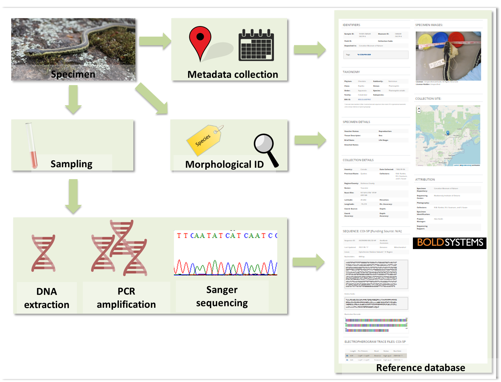

==================================
The use of DNA to identify species
==================================

All organisms have genomes with information encoded by either DNA (most
organisms) or RNA (some viruses like COVID-19, SARS, influenza, Ebola). Genome size varies
enormously among organisms. For example, excluding viruses, genomes range from as small
as ~800 kilobases for some bacteria up to ~150 gigabases (flowering plant Paris japonica).
However, just as species show differences in their morphology and ecology, so too do they
show differences in the nucleotide sequence of their genomes with differences between any
two organisms commensurable to their evolutionary distinctiveness. This means that we can
diagnose distinct species, even those that are closely-related, or sometimes even lineages
within species, using relatively short fragments of DNA or RNA sequences alone. The use of
DNA sequences for species-level identification is called “DNA Barcoding” (Hebert,
Ratnasingham, and de Waard 2003). In traditional DNA barcoding, from a tissue sample (e.g.,
leaf, insect leg, blood) that has been collected with appropriate metadata: 1) DNA is extracted
from a sample; 2) a focal region of the genome, usually within a single gene (the ‘DNA
barcode’) is targeted and amplified in millions of copies using short flanking sequences called
primers via polymerase chain reaction (PCR); 3) the barcode copies are sequenced (using
Sanger sequencing – although Next Generation sequencing methods can be used); and 4) the
resulting barcode sequences are compared to a reference database which contains
information on many species linked to their barcodes (e.g. Barcode Of Life Database – BOLD
or the US National Institute of Health’s Genbank; Ratnasingham and Hebert 2007; Benson et
al. 2008) (:numref:`workflow`). Different genes can be targeted depending on the organism; for example,
the mitochondrial cytochrome c oxidase subunit I (COI) gene is preferred for most animal
groups and the chloroplast ribulose-bisphosphate carboxylase (rbcL) and maturase K (matK)
regions are preferred for plants (Porter and Hajibabaei 2018).

While barcoding was initially associated with specimens deposited in museum
collections, it has been successfully applied to DNA sampled from the environment (eDNA),
overcoming the need of capturing or indeed even seeing individuals to detect the presence of
species (Thomsen and Willerslev 2015).

.. _workflow:

   Traditional barcoding workflow.
