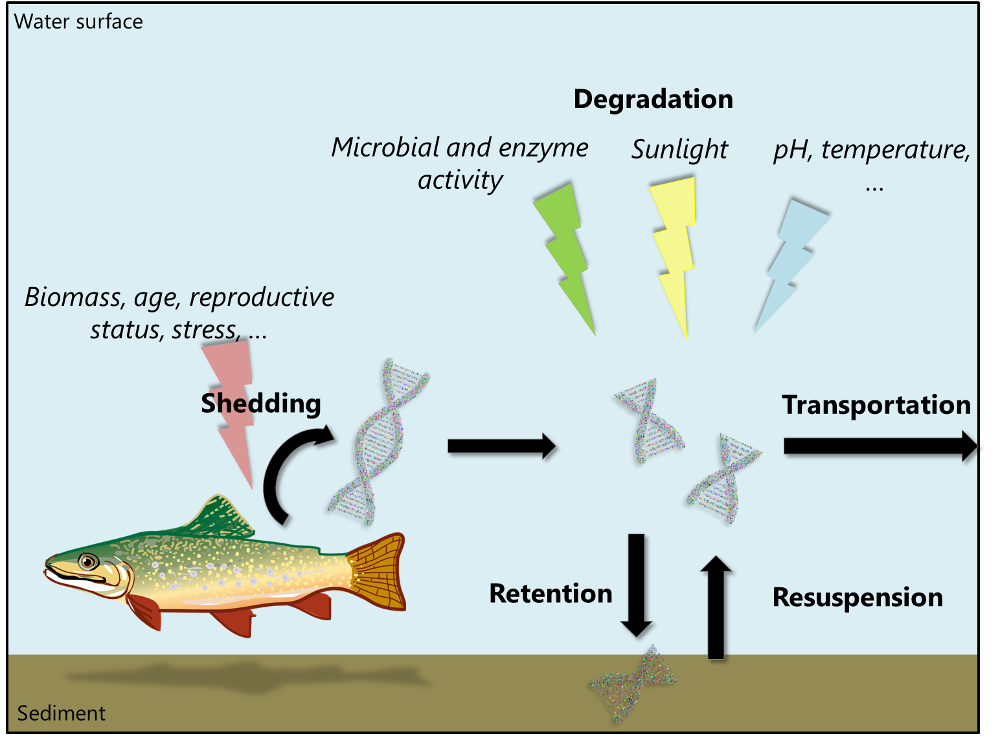
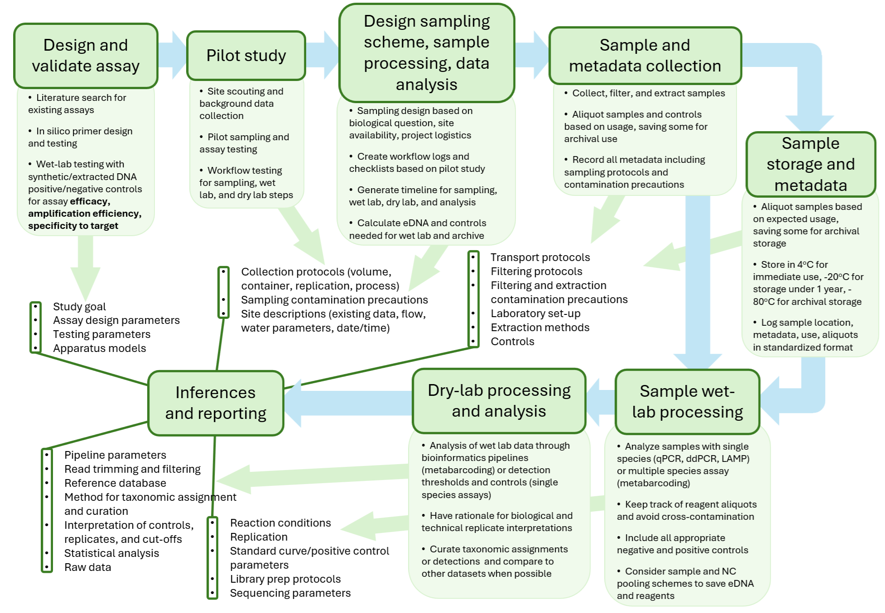

=============================
Overview of environmental DNA
=============================

eDNA is defined as a pool of DNA isolated from environmental samples including
sediment, soil, water, air, feces, or even the surfaces of leaves (Pawlowski, Apothéloz-Perret-
Gentil, and Altermatt 2020; Taberlet et al. 2012). eDNA can derive from whole organisms (e.g.
diatoms in water) or gametes, or come from various tissues, secretions like mucus, blood,
feces, urine, saliva, and shed skin, scales or hair. Mentions of eDNA appeared for the first time
in the literature in 1987 (extraction of DNA from sediments; Ogram, Sayler, and Barkay 1987)
and were extended to macro-organisms by the end of the 2000s (see Taberlet et al. 2018 for
a review on the timeline for eDNA studies). Note that the definition of eDNA is still debated
(see Pawlowski, Apothéloz-Perret-Gentil, and Altermatt, 2020 for a review). In this manual
we refer to the general concept of eDNA, that is a total pool of DNA isolated from
environmental samples independently of its structural state (intra/extra-cellular) (Taberlet et
al. 2012; Pawlowski, Apothéloz-Perret-Gentil, and Altermatt 2020).

Multiple factors shape the state and detectability of eDNA in the environment (review
in Rourke et al. 2022). Some organisms are simply less detectable because they shed less DNA
(Allan et al. 2021). Biomass, age, activity, and stress all relate to DNA concentration in the
environment (Stewart 2019; Thalinger et al. 2021a). The probability of detecting any taxon
using eDNA can also vary according to the stage of its life cycle (e.g. increased probability
during the breeding season because of higher organism activity and release of gametes;
Buxton et al. 2017; Buxton, Groombridge, and Griffiths 2018). eDNA exists in several states in
the environment: as intracellular or intra-organellar DNA, dissolved DNA in the water, and
particle adsorbed DNA (Mauvisseau, Harper, et al. 2022). As cells break down in the water,
they release their mitochondria and/or chloroplasts. As cells and organelles undergo lysis,
they release dissolved DNA, which may then adsorb onto suspended particles in the water
(Mauvisseau, Harper, et al. 2022). Because there are typically many organelles and
corresponding copies of mitochondrial/chloroplast DNA per cell, those genes are often
preferred targets for eDNA assays.

Once DNA is released into the environment, several biotic and abiotic factors can
influence its persistence and detection probability (:numref:`fig_processes`). eDNA can diffuse and thus be
transported tens of kilometres by external means such as human activities (e.g. boats) or
animals (e.g. leeches, predator), or by internal sources such as stream flow (Deiner and
Altermatt 2014). Three main processes control eDNA movement in stream: transport,
retention, and resuspension (Shogren et al. 2017). Shogren et al. (2017) quantify transport as
the distance an average eDNA particle travels in streams with different hydrologic signatures,
and define retention as DNA that is trapped in porous benthic substrate interstices because of
surface-subsurface exchanges, and resuspension as release of DNA from the streambed
resulting in eDNA detection after the source of eDNA has been removed. While transport of
eDNA may be an issue for deducing location of a detected species or local species richness,
Deiner et al. (2016) showed that eDNA data gleaned from sampling stream networks can
provide insights on biodiversity distribution across hierarchical spatial scales, including both
terrestrial and aquatic species. In soil, eDNA derives mainly from organisms living below the
ground surface (e.g. insect larvae, plant roots) and from the soil microbiome (Taberlet et al.
2018; Kirse et al. 2021).

Degradation of eDNA is affected by multiple key biotic and abiotic factors – light
exposure, temperature, oxygen, pH, microbial activity and extracellular enzymes can shorten
eDNA lifespan from a couple of week to only a few days (Barnes et al. 2014; Oehm et al. 2011;
Strickler, Fremier, and Goldberg 2015). This means that eDNA signals can provide a relatively
contemporary ‘snapshot’ of occurrences of taxa present in a sampled environment. However,
in some environments where DNA degradation does not occur as rapidly (e.g. cold and dry
sediments), eDNA can be preserved for (potentially) hundreds or even thousands of years and
has been used to assess past biodiversity (Willerslev et al. 2003; Thomsen and Willerslev
2015). Recommendations on how to adjust sampling strategies to account for factors
expected to decrease detection probability have been detailed in the practical guide for DNAbased
methods for biodiversity assessment (Table 2 in Bruce et al. 2021). Overall,
environmental parameters affecting eDNA state conversion and degradation are not
completely understood (Mauvisseau, Harper, et al. 2022). Current best practice involves
reporting as many parameters as possible, and using analytical controls during water sampling
and processing.

.. _fig_processes:

         influencing eDNA detection in the environment.

   Illustration of the processes (shedding, degradation, retention, resuspension, transportation)
   influencing eDNA detection in the environment.

Standards for eDNA workflows and reporting are in development or have recently
emerged (See CSA W214:21 and CSA W219:23). Current best practice includes meticulous
documentation of assay development, sampling schema, multiple controls, filtration
protocols, contamination precautions, metadata collection, wet-lab processing, dry lab
processing, detection criteria, and statistical analyses (Goldberg, Turner, et al. 2016). See
:numref:`fig_flowchart` for a workflow chart and recommended reporting at each stage.

.. _fig_flowchart:

         minimum recommended reporting standards for each stage.

   Conceptual flowchart of a potential workflow for developing an eDNA study, with
   minimum recommended reporting standards for each stage.
