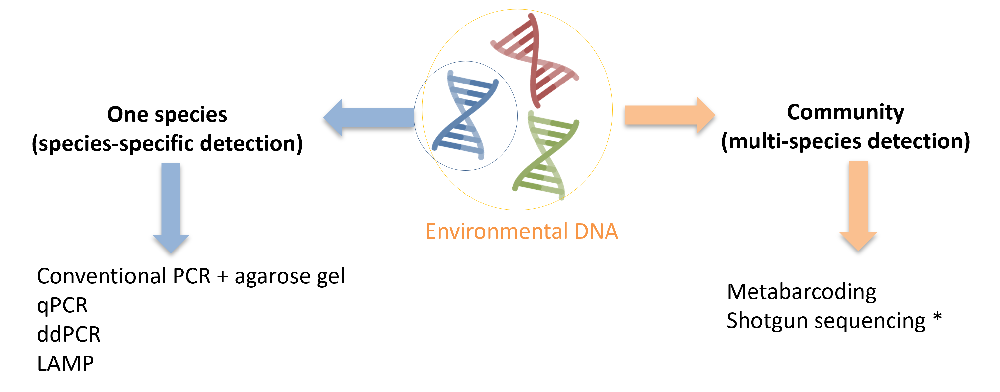

====================================================
The use of environmental DNA for wildlife monitoring
====================================================

Data collected through wildlife (sensu lato) monitoring are useful to assess ecosystem
health, understand short- and long-term ecosystem changes, inform management of speciesat-
risk and support efforts of habitat restoration. Various methods are used to map diversity
of ecosystems and collect information on individual species and populations. Conventional
survey methods can include censusing (e.g. point counts, acoustic monitoring, electrofishing),
trapping (e.g. seining, mist netting), and implantation of monitoring devices (e.g. passive
integrated transponder or PIT tags, radiotelemetry), but these methods may cause stress,
require significant expertise, and may be logistically challenging.

Over the last decade, eDNA-based methods have been increasingly deployed to map
biodiversity, monitor rare and cryptic species or pathogens, identify early stages of biological
invasions, and assess diet and trophic interactions (Beng and Corlett 2020; Bohmann et al.
2014). National and international conservation organisations and companies have begun to
develop large eDNA-based programs. For example: i) Since 2019, Environment and Climate
Change Canada’s (ECCC) Canadian Aquatic Biomonitoring Network (CABIN) program in
partnership with the University of Guelph and World Wildlife Fund (WWF – Canada) have
integrated DNA analysis to identify freshwater benthic macroinvertebrates and assess aquatic
ecosystem health, ii) In 2021 the International Union for Conservation of Nature (IUCN) and
NatureMetrics launched eBioAtlas, a programme that aims to address global freshwater
biodiversity gaps using cutting-edge eDNA technology on >30,000 freshwater samples from
around the world.

Identifying taxa from an eDNA sample can be done using different approaches,
depending on the aim of the study (:numref:`fig_approaches`), and are described in the sections
below.

.. _fig_approaches:

   eDNA species-specific and multi-species approach.

   \* : method not described in detail in this manual.
