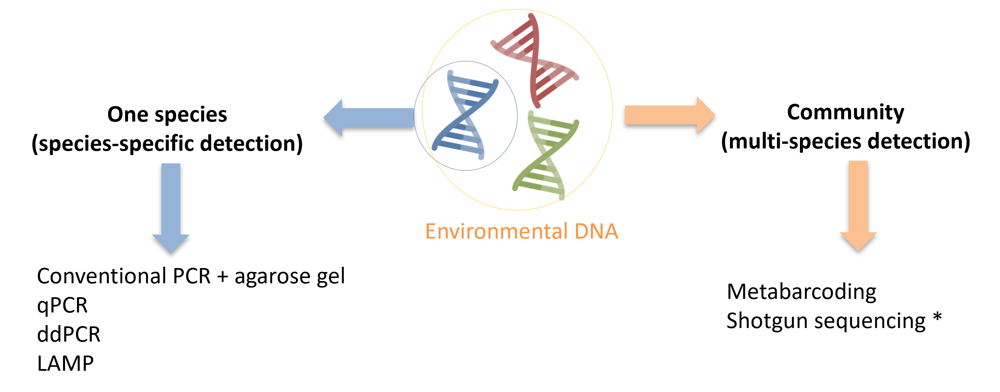

====================================================
The use of environmental DNA for wildlife monitoring
====================================================

Data collected through wildlife (sensu lato) monitoring are useful to assess ecosystem
health, understand short- and long-term ecosystem changes, inform management of species-at-risk
and support efforts of habitat restoration. Various methods are used to map diversity of ecosystems
and collect information on individual species and populations. Conventional survey methods can
include censusing (e.g. point counts, acoustic monitoring, electrofishing), trapping (e.g. seining,
mist netting), and implantation of monitoring devices (e.g. passive integrated transponder or PIT
tags, radiotelemetry), but these methods may cause stress, require significant expertise, and may
be logistically challenging.

Over the last decade, eDNA-based methods have been increasingly deployed to map biodiversity,
\monitor rare and cryptic species or pathogens, identify early stages of biological invasions,
and assess diet and trophic interactions (Beng and Corlett 2020; Bohmann et al. 2014). National
and international conservation organisations and companies have begun to develop large eDNA-based
programs. For example: i) Since 2019, Environment and Climate Change Canada’s (ECCC) Canadian
Aquatic Biomonitoring Network (CABIN) program in partnership with the University of Guelph and
World Wildlife Fund (WWF – Canada) have integrated DNA analysis to identify freshwater benthic
macroinvertebrates and assess aquatic ecosystem health, ii) In 2021 the International Union for
Conservation of Nature (IUCN) and NatureMetrics launched eBioAtlas, a programme that aims to
address global freshwater biodiversity gaps using cutting-edge eDNA technology on >30,000
freshwater samples from around the world.

While environmental DNA (eDNA) assays have been intensively explored for aquatic biodiversity
monitoring, a comparable effort for terrestrial biodiversity has been lacking. The use of
environmental DNA for terrestrial biodiversity monitoring was investigated previously using for
various sources, including water (Newton et al. 2025), soil (Ariza et al. 2023), leaf surfaces
(Lynggaard et al. 2023; Kudoh, Minamoto, and Yamamoto 2020), rain (Macher et al. 2023;
Zinger et al. 2025), gut contents of invertebrates (e.g. leech, Drinkwater et al. 2021) and the
faeces of generalist vertebrates (Nørgaard et al. 2021). Despite these efforts, taxonomic coverage
has remained rather limited. The search for a more comprehensive assessment tool recently led to
the emergence of airborne eDNA. Airborne eDNA originates from a variety of biological sources,
including microorganisms (e.g., viruses, bacteria, microalgae, fungi), propagules (e.g., fungal
spores, pollen), and biological fragments (e.g., tissue, excretions, cells; Després et al. 2012).
While airborne eDNA assays are not novel — having long been used to detect airborne microbial
communities, pollen, and fungal spores — its application to broader taxonomic groups is a recent
development. The first studies targeting non-anemophilous (species that are not wind pollinated)
plants appeared a few years ago (Johnson, Cox, and Barnes 2019), followed by studies on arthropods,
particularly insects (Roger et al. 2022), and more recently, vertebrates. Vertebrate airborne eDNA
research began in 2021 with a proof-of-concept study by Clare et al. (2021), which successfully
detected naked mole-rat DNA under controlled laboratory conditions. Subsequent studies explored
semi-controlled environments, including zoos in the UK and Denmark (Clare et al. 2022;
Lynggaard et al. 2022) and semi-confined spaces (e.g. bat roosts within caves - Garrett, Watkins,
Simmons et al. 2023), before expanding to natural environments in both temperate and tropical
ecosystems (e.g., Belize, Garrett, Watkins, Francis et al. 2023; USA, Johnson et al. 2023;
Denmark, Lynggaard et al. 2024). However, to our knowledge relatively few studies have successfully
recovered DNA from multiple taxonomic groups. Notably, Littlefair et al. (2023) and Tournayre et al.
(2025) demonstrated the ability to detect a remarkable breadth of diversity, including plants,
fungi, invertebrates, and vertebrates, using airborne eDNA collected as a by-product of air quality
monitoring stations. This includes under-represented taxa in traditional biodiversity surveys,
invasive species, pests, and diseases vectors, highlighting the potential applications of airborne
eDNA beyond biodiversity monitoring (Tournayre et al. 2025). Air quality monitoring infrastructure
is globally distributed and offers a comprehensive, cost-efficient and scalable method for
surveying terrestrial biodiversity by relying on international protocols which have already been
highly standardized (e.g. sampler height, volume of air filtered, filter type), favouring
consistency and comparability across studies. However, this approach might be challenging when
targeting remote groups or very specific locations. Common air sampling techniques include active
methods with easily-portable devices such as 3D-printed filter frames powered by computer fans
(Garrett, Watkins, Francis et al. 2023; Garrett, Watkins, Simmons et al. 2023) and cyclone samplers
(Thuillet et al. 2024), as well as passive methods like dust traps (Johnson et al. 2023;
Johnson, Cox, and Barnes 2019). Despite its extraordinary potential, it is important to remember
that airborne eDNA, as with any eDNA approach, presents several methodological challenges requiring
further study to better understand the ecology of eDNA particles. One key concern is the inherently
low DNA concentration and high degradation rates, which can lead to false negatives (i.e., species
present but not detected) and false positives (i.e., species not present but detected) due to
contamination during sample collection and laboratory analysis. Consequently, it is crucial to
adhere to gold-standard eDNA workflows, incorporating stringent quality control measures.
Additional challenges include rapid particle sedimentation, which may limit detection success, and
the complex dynamics of air currents (similar to water current for aquatic eDNA), which can
transport eDNA over long distances, complicating source attribution. Future research must assess
the influence of particle size, shape (e.g., aerodynamic properties), and environmental factors
(e.g., wind speed, wind direction, rainfall) not only on detection success but also on the quantity
of eDNA recovered.

Identifying taxa from an eDNA sample can be done using different approaches,
depending on the aim of the study (:numref:`fig_approaches`), and are described in the sections
below.

.. _fig_approaches:

   eDNA species-specific and multi-species approach.

   \* : method not described in detail in this manual.
