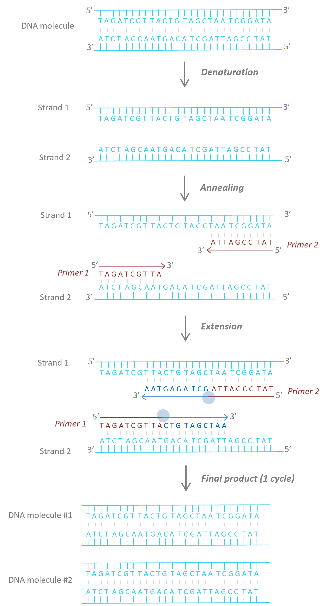
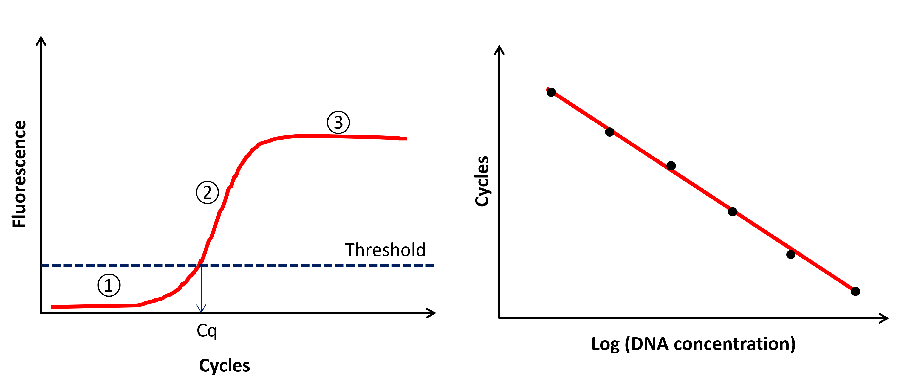
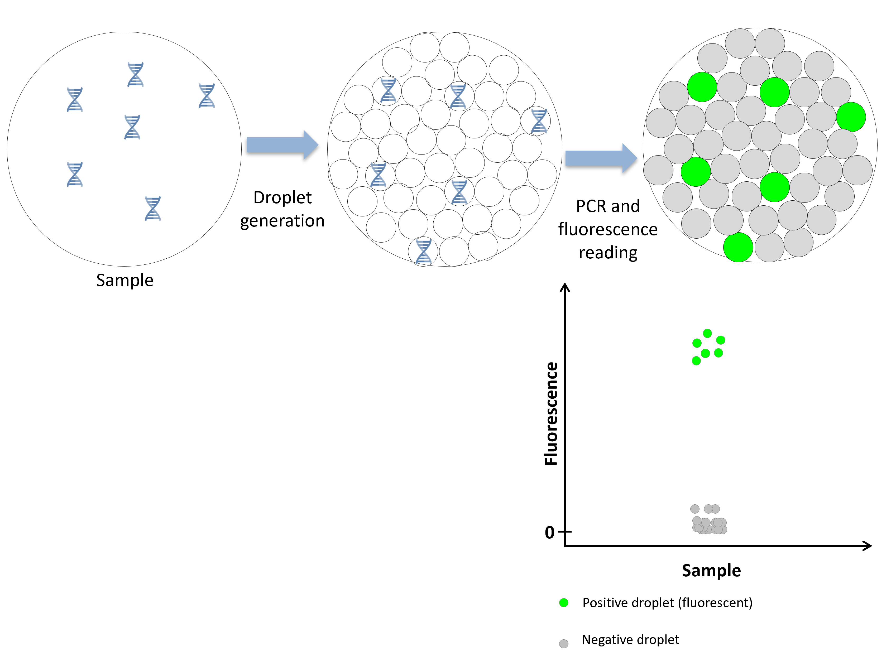
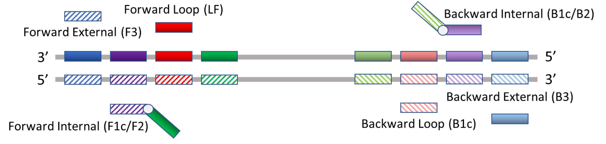
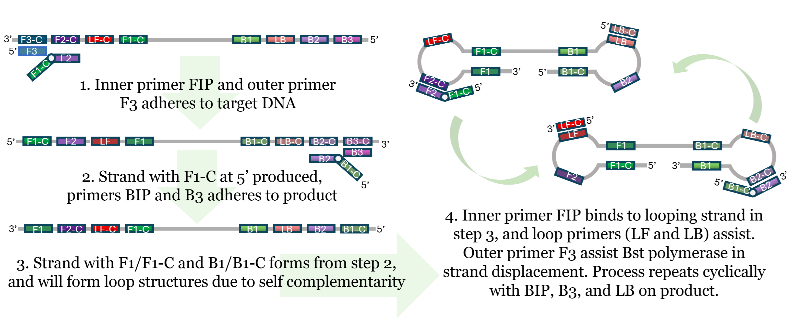

======================================================
Overview of the methods: eDNA single-species detection
======================================================

Single-species detection can be done using conventional polymerase chain reaction
(PCR; Ficetola et al. 2008; Jerde et al. 2011), quantitative PCR (qPCR; Langlois et al. 2021;
Higuchi et al. 1993), digital PCR (Mauvisseau et al. 2019), or loop-mediated isothermal
amplification (LAMP; Notomi et al. 2000).

Conventional Polymerase Chain Reaction (PCR)
============================================

The presence/absence of a species in an environmental sample can be determined
using conventional PCR and agarose gel electrophoresis (:numref:`fig_pcr_phases`) (Ficetola et al. 2008; Jerde
et al. 2011; Olson et al. 2012; Mahon et al. 2013; Dejean et al. 2011). Positive samples are
indicated by a distinct band at the expected amplicon size (length of the target DNA fragment
plus the flanking primers). While this approach is the cheapest for single species detection, it
is less sensitive generally compared to other approaches and may not work for rare species (
because of lower probability of detection at low concentration) and can show more specificity
issues (Xia et al. 2018; Wilcox et al. 2013). The combination of PCR and Sanger sequencing
(identification of the PCR-amplified sequences) on environmental samples can be used to
confirm the presence of rare species (e.g. detection of rare species of bats using guano,
Puechmaille and Teeling 2014). The effectiveness of the combination temperature/denaturing
gradient gel electrophoresis (TGGE/DGGE; separate mixed PCR products from various taxa in
a sample) and Sanger DNA sequencing has been explored for diet analysis using fecal samples
(Martin et al. 2006). For example, Thongjued et al. (2021) were able to identify 25 prey species
in 207 fecal samples of the wrinkle-lipped free-tailed bats (Chaerephon plicatus) in Thailand.
While it is less efficient (fewer species identified) than DNA metabarcoding, it is a cheaper
alternative and is more readily available to laboratories with only basic molecular
infrastructure. Assays can cost under a dollar per sample, depending on reagent costs.

Conventional PCR is limited to presence/absence interpretation because one only
assesses final concentrations of the focal amplicon (i.e. after PCR amplification), but these
values are not necessarily proportional to original concentration in the environmental sample
(stochasticity and amplification bias; Kelly, Shelton, and Gallego 2019).

.. _fig_pcr_phases:

   PCR phases. i) Denaturation (92°-95°C): heat denatures DNA strands into single-stranded
   template DNA. ii) Annealing (55-65°C): primers bind to their complementary
   sequence on the single-stranded template DNA. iii) Extension (72°C): Taq polymerase (blue
   circle) extends the primers: new strands of DNA are now synthetized. At the end of each cycle
   of the three phases, the number of DNA molecules is doubled. The cycles are repeated
   between 30 and 40 times to obtain millions of DNA molecules.

Quantitative PCR (qPCR)
=======================

Quantitative PCR (qPCR) records the accumulation of DNA sequences in real time (thus
sometimes called real time PCR) during amplification via the continuous measurement of a
fluorescence signal incorporated into the amplified DNA. Most eDNA-based studies have
shown a positive relationship between focal taxon abundance or biomass and eDNA
concentration estimated using qPCR (Rourke et al. 2022). The two main chemistries for qPCR
assays use either an intercalating dye, typically SYBR green (a fluorescent cyanine dye used as
a nucleic acid stain), or a fluorescent probe (often TaqMan brand, specific oligonucleotide
probes with a fluorophore at its 5’-end and a quencher at its 3’-end). SYBR-based assays are
typically lower cost compared to probe-based assays, but have lower specificity due to the
lack of a third primer-probe between the forward and backward primers, and cannot be
multiplexed (where primer pairs for multiple species are run in the same reaction, potentially
saving reagents and sample/template DNA). Multiplexed probe-based assays must have
compatible fluorophore channels (specific to a qPCR platform) and quenchers.

SYBR green binds to double stranded DNA during amplification in a non-specific way
whereas the Taqman probe chemistry relies on a 20bp sequence (probe) that specifically binds
to the desired DNA fragment. During extension using the probe, the fluorophore and the
quencher are cleaved out allowing the emission of the fluorescence signal. Thus, the
quantification of DNA using those chemistries is made possible by the continuous
proportionality between the level of fluorescence and the amount of amplified DNA. As the
fluorescence is directly proportional to the number of amplicons produced during
amplification, the fluorescence follows a typical amplification curve over the amplification
cycles (:numref:`fig_fluor_emission` A). During the first cycles the fluorescence emission cannot be distinguished
from the background noise (too few amplicons; PHASE 1), after which fluorescence level
exceeds the background noise (detection threshold) and linearly increases (PHASE 2) to reach
a plateau during which very few new amplicons are produced (PHASE 3). The number of cycles
to pass the detection threshold (Ct or Cq value - synonyms) is inversely proportional to the
number of copies of template DNA originally present in the sample. The unknown
concentration of the extracted DNA sample is calculated using a linear regression of known
concentration standards (“standard curve” or “calibration curve”, :numref:`fig_fluor_emission` B). The standard
curve is made from serial dilutions (2 to 10-fold) of a positive control (known concentrations
of DNA of the species of interest). Synthetic DNA is preferred to DNA extracted from tissue or
blood, as it has a fixed number of base pairs and can be quantified in terms of copies per
volume (Langlois et al. 2021). When using extracted DNA, it is typically best to verify the
identity of the sample through PCR and Sanger sequencing if possible.

.. _fig_fluor_emission:

   **A)** Fluorescence emission across cycles. Phase 1 is defined by fluorescence emission
   below the background noise (threshold of fluorescence). Phase 2 is defined by a linear increase
   of the fluorescence emission and phase 3 by a plateau of fluorescence. Cq is the number of
   cycle to reach the threshold of fluorescence (i.e. fluorescence above background noise). **B)**
   Standard curve results. Each dot represents a concentration standard of the dilution series.

Quantitative PCR assay performance is evaluated using four metrics :math:`R^2`, PCR efficiency
(:math:`E`), Limit of Detection (LOD) and Limit of Quantification (LOQ).

.. italicize R squared?

:math:`R^2` indicates how well the replicates fit on the standard curve (linearity). Usually we aim for
:math:`R^2 > 98\%`.

*PCR efficiency* (:math:`E`) is calculated using the formula:

.. The equation should be centred

.. math::
   E = 10^{-1 / \text{slope of the standard curve}} - 1

When :math:`E=100\%`, this indicates that the amount of DNA product doubles with each cycle
(MIQE guideline, Bustin et al. 2009). Lower values of E result from poor amplification, for
example due to non-optimal qPCR mix or cycling conditions, secondary structure or primer
dimers that affect primer-template annealing (poor amplification). :math:`E >100\%` generally reveals
polymerase inhibition, either by excessive initial DNA concentration or the presence of
inhibitors in the sample (i.e. substances that negatively impact amplification because they
interact with DNA or the polymerase). A value that exceeds 100% means that even if more
DNA template is present in the reagent mixture, the Cq values might not shift accordingly
which flattens out the efficiency plot, (lower slope and :math:`E > 100\%`). We typically aim for
:math:`90\% < E < 110\%`.

*Limit of Detection (LOD)* and *Limit of Quantification (LOQ)*. The definition of the LOD and LOQ
vary among authors (Forootan et al. 2017; Klymus et al. 2020a; Hunter et al. 2017; Brys et al.
2021) but the take home messages are:

.. a numbered list with three items automatically enumerated?

#. LOD is a threshold above which it is possible to assess presence/absence of the target
species with confidence even at low numbers of DNA copies,
#. LOQ is the threshold over which we can confidently quantify the concentration of the
target species (lowest value of the linear dynamic range of the standard curve). LOQ
can only be equal to or greater than LOD.
#. The LOD and the LOQ can be assessed using various methods, including discrete
threshold methods and modelling methods (Klymus et al. 2020a; Hunter et al. 2017).

Example of discrete threshold method (Kubista 2014; Klymus et al. 2020a): The LOD is
the lowest concentration of standard that produces at least 95% positive replicates (notemplate
and negative controls must be blank). The LOQ is the lowest concentration of a
standard whose coefficient of variation (relative standard deviation of the mean) value is
below 35%. It is common to detect target DNA at concentrations below the LOD when multiple
technical replicates are used: those detections should be interpreted with lower confidence.
To overcome the issue of multiple technical replicate variability, Hunter et al. (2017) consider
the LOD as “the lowest amount of analyte that can be both detected and distinguished from
the concentration plateau” of the standard serial dilution.

We also strongly recommend reading Thalinger et al. (2021b) to understand how to
interpret and fully appreciate the results of qPCR and get robust species-specific assays. The
authors provide a five level validation scale specifically for the use of qPCR in eDNA studies.
Validation is typically specific to your primer set, qPCR machine model, qPCR consumables,
and even the target region. It is critical that one tests assays from the literature before
extensive use.

Digital PCR (dPCR)
==================

Digital PCR (dPCR) is an emerging technique for highly precise quantification of nucleic
acids through partitioning into many simultaneous reactions. It is generally considered to be
more sensitive than PCR followed by gel electrophoresis/Sanger sequencing and qPCR (Mao
et al. 2019). dPCR involves separating a PCR reaction into thousands of microfluidic-scale
volume partitions, where each partition can have no template DNA present, one copy of
template DNA, or many copies of template DNA depending on the concentration in the
original sample. When the number of partitions greatly exceeds the number of copies of
template DNA, most partitions theoretically will contain zero or one copies of template.
Therefore, the number of positive partitions is equal to the number of copies of template
target DNA, and any stochasticity and droplets with multiple copies can be corrected for with
Poisson statistics (Zhu et al. 2015). Advantages of dPCR include providing absolute
quantification without a standard curve through Poisson distribution corrected binary counts
of template DNA, high accuracy and sensitivity (which also corresponds to low sample volume
requirements, which is often highly beneficial for eDNA samples), and better resistance to PCR
inhibitors due to being an end-point assay with independence on amplification efficiency
between partitions (Zhut et al. 2015, personal communication, Bio-Rad). However, inhibition
can still affect dPCR results (Chen et al. 2023), and should therefore always be investigated
regardless of the technology used. Weaknesses of the technique includes typically higher costs
of the instrumentation and reagents than qPCR, narrow dynamic range (with a low maximum
template DNA concentration), and potentially lower throughput. dPCR assays use the same
primer/probe that qPCR assays use, so qPCR assays can be quickly adapted to dPCR. However,
polymerase master mixes are typically specific to a dPCR platform, and cannot be
interchangeably used. Most dPCR platforms are also suitable for multiplexing which can save
cost of consumables and time. As a relatively new technology, dPCR platforms and best
practices are constantly and quickly evolving.

Partitioning can be achieved through two main categories of methods. Chip-based
methods use microfluidic arrays on chips or plates. With chip dPCR, the reaction mixture is
pumped into nanoliter-scale chambers (between 10,000 to 40,000) through microfluidic
forces (e.g. capillary action, centrifugal forces). The reactions then undergo thermocycling.
The resulting fluorescence is then read in a way similar to pixels on a monitor (Zhang et al.
2015). Chip dPCR (cdPCR) systems include Standard BioTools’ (formerly known as Fluidigm)
BioMark HD system, ThermoFisher’s QuantStudio Absolute Q Digital PCR system, and Qiagen’s
QIAcuity system (Standard BioTools Inc, Thermo Fisher Scientific Inc, Qiagen N.V, Dong, Ming
et al., 2015).

Droplet digital PCR (ddPCR) is based on water-oil emulsion droplet technology: a DNA
sample is randomly partitioned into up to 20,000 individual droplets which are then
independently amplified by conventional PCR enabling detection and quantification of very
low amounts of DNA (Nathan et al. 2014) (:numref:`fig_ddPCR`). Concentration of target DNA is then
determined by the fraction of positive droplets at the end of the PCR reaction (:numref:`fig_ddPCR`),
whereas qPCR fluorescence is measured in real-time. ddPCR has several advantages compared
to qPCR (Mauvisseau et al. 2019; Kamel et al. 2021; Doiet al. 2015a; Doiet al. 2015b): 1) ddPCR
provides absolute quantification without the use of a standard curve; 2) ddPCR has a lower
sensitivity to inhibitors (e.g. humic substances) present in environmental samples; and 3) the
quantified concentration can be more accurate than qPCR especially at low concentration. As
of April, 2024, Bio-Rad is the only supplier of ddPCR systems (see references).

.. _fig_ddPCR:

   ddPCR workflow and graphic output.

Loop-mediated isothermal amplification (LAMP)
=============================================

Notomi et al. 2000) but was first applied to single-species detection in eDNA-based studies
only a few years ago (Davis et al. 2020; Williams et al. 2017; Kamel et al. 2021; Vythalingam,
Hossain, and Bhassu 2021). LAMP involves using polymerases isolated from thermophilic
bacteria (Milligan et al. 2018) that can cycle through dsDNA denaturation and amplification in
isothermal conditions (i.e. does not require the multiple steps at different temperatures used
in conventional PCR). In LAMP, four to six primers are used to target six to eight regions of a
target sequence of DNA. These consist of a pair of external primers (which are similar to
conventional PCR primers), a pair of internal primers, one complementary to the sense strand
slightly downstream of the external primers, and the other complementary to an inner region
of the target DNA sequence, and finally an optional pair of loop primers, which target regions
between the two internal primer targets (:numref:`fig_lamp1`). For more information on the mechanisms
of LAMP, refer to: https://youtu.be/L5zi2P4lggw and :numref:`fig_lamp2`.

LAMP has advantages and disadvantages over PCR, qPCR, or ddPCR. Unlike PCR-based
detection methods, LAMP is isothermal and does not require temperature cycling. This can
greatly reduce the cost and size of apparatus and power needed, facilitating its use for on-site
detection and citizen science-based approaches. LAMP is highly tolerant of inhibitory salts and
physicochemical conditions common to eDNA samples. Yield and speed are typically superior
to PCR based methods and can be visible to the naked eye through turbidity induced by
magnesium pyrophosphate precipitation or pH change (Soraka et al. 2021, Mori et al. 2001,
Tanner et al. 2015). Due to the larger number of primers, LAMP is typically thought to be more
specific than non-probe-based qPCR (probes significantly raise the cost of qPCR). LAMP primer
design also does not require gradient PCR testing. However, LAMP products are complex
mixes of concatemers with the target sequence, and not suitable for downstream applications
without further processing (Sahoo et al. 2016). LAMP is also difficult to multiplex, the primers
are difficult to design manually, and LAMP reagents are more costly due to lower economy of
scale. Nevertheless, the use of LAMP in biomedical and environmental detection has received
significant recent attention (Seki et al. 2018; Ganguli et al. 2020).

.. _fig_lamp1:

   Primers used in LAMP. The boxes on the lines represent different parts of the target
   sequence. Striped boxes are complementary to solid boxes of the same colour. Free floating
   boxes are primers, and their colour and solid/striped fill-in indicates which part of the target
   sequence they are from. Primers are approximately 20 bp long.

.. _fig_lamp2:

   LAMP process.

Inhibition and Internal Positive Controls (IPC)
===============================================

eDNA samples often contain compounds that inhibit PCR or impede fluorescence
(McKee et al. 2015), resulting in potential false negatives or lower detected concentrations.
Inhibitors include compounds from decaying organic materials, such as tannins, humic acids,
and fulvic acids, excreted compounds , such as bile salts, complex polysaccharides, and urea,
and intra-cellular/intra-tissue compounds, such as collagen, heme, and calcium ions (Hunter
et al. 2019, Rådström et al. 2004). Environmental conditions such as pH can also result in PCR
inhibition.

Inhibition effect can be assessed using an Internal Positive Control (IPC, see Klymus et
al. 2020b for more details). This typically involves the addition of a low concentration
(approximately 100 copies/μL) of foreign DNA (DNA that is unlikely to be present in your
sampled site; e.g. from a species endemic to a different continent) and a matching assay which
must be multiplexed with your target assay to both your eDNA samples and no-template
controls. Non-amplification, a Cq value shift of over three cycles, or a much lower
concentration of your IPC assay in your eDNA samples compared to your NTC indicates
inhibition (Hartman et al. 2005). IPCs must be validated through testing with your assay, as
multiplexing may be a source of competitive inhibition in itself.

When inhibition is detected, methods for reducing it include diluting the eDNA sample
with buffer or dH2O, altering PCR conditions (by adding bovine serum albumin, using a more
inhibitor-resistant polymerase, changing cycle count, step length, or ramping time) or inhibitor
removal (through a commercial kit, re-extraction, or ethanol precipitation) (Chen et al. 2023).
All methods come with their own risks, such as DNA loss with dilution or inhibitor removal, or
false positives with changing PCR parameters (Goldberg et al. 2016). Inhibition is a complex
topic that requires trial and error based testing for each study.

