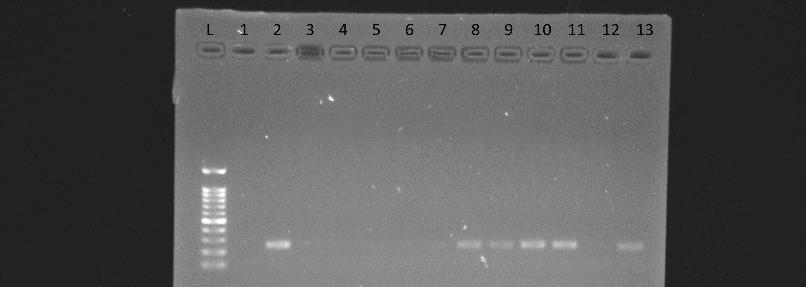
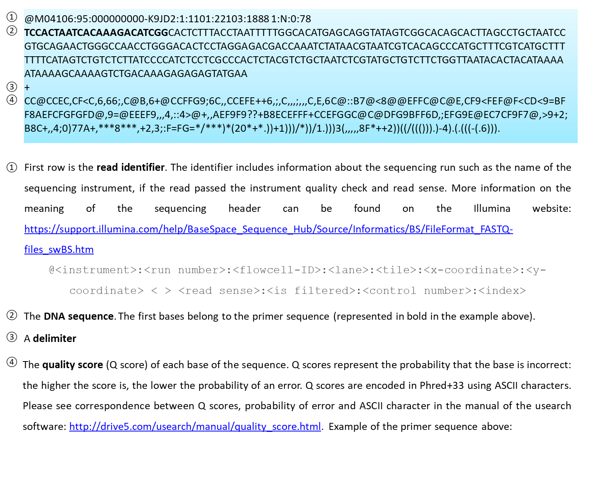

=========================
From study design to data
=========================

Planning
========

The first step in eDNA study design is to define the study objectives and how eDNA
approach(es) may be useful to address them. eDNA approaches are particularly relevant to
describing biotic assemblages, or detecting elusive or cryptic species, and species at low
density without the need for taxonomic expertise. By reducing fieldwork costs and sampling
time, these methods may also allow users to cover larger sampling areas or sample more
frequently. One can target: i) one species of interest, ii) multiple species from a single sample
using metabarcoding or iii) different single target species reusing the same samples for
multiple projects. Here are a few scenarios illustrating the applications of eDNA.

**Example 1:** eDNA would allow me to simultaneously monitor multiple species across multiple
locales without need to capture the individuals. This would decrease the cost and labour
associated with capture and mitigate the need for identification of individuals by taxonomists.

**Example 2:** eDNA tools would be a cost-effective way to assess the spread of an invasive
species. This would be especially useful at the ‘invasion front’ where invasive species are
usually at low densities and less likely to be captured.

**Example 3:** eDNA surveys using qPCR, ddPCR or LAMP could help me to rapidly survey multiple
sites for the presence of a species at risk allowing us to focus conservation efforts on these
sites or to undertake further research.

**Example 4:** eDNA from faeces of a species at risk would enable me to quantify its diet noninvasively
and potentially include recommendations for management of prey species in future
conservation programs.

**Example 5:** eDNA assays for an emerging pathogen in air, water, soil or on environmental
surfaces (e.g. tree leaves) might allow early detection and enable mitigation strategies.

It is also very important to consider the limits of the eDNA approaches in your study.
Some information may not be available to address particular questions with your data derived
solely from eDNA approaches. For example, eDNA may not provide estimates of absolute
individual abundance, reproductive status, or population size. eDNA may not be sufficient to
assess health status of individuals within a population of organisms nor provide direct insights
on interactions among species; in this sense having developed and refined your objectives and
the value but also limits of eDNA approaches, you might wish to weigh the costs of labour and
molecular consumables, and access to laboratory instruments (e.g. qPCR machine) or
appropriate spaces (e.g. a clean lab dedicated to eDNA) to process the samples and ensure
data quality and minimize contamination. It is often easy to propose to use eDNA to address
important questions in conservation, ecology or epidemiology, but it can be much harder to
deliver high-quality, validated eDNA data. Clean labs ideally have positive air pressure to
minimize contamination, HEPA filtration, a one-way workflow, and are easily cleaned and
sterilized. Because of the price and the need for a clean eDNA dedicated space (Table 1), it is
often more cost-effective to collaborate with eDNA researchers or use services provided by
companies. See :numref:`flowchart_with_costs` for rough estimates on costs and labour requirements.

- Examples of academic eDNA research labs in Canada: Lougheed Lab (Queen’s University, ON),
  Clare Lab (York University, ON), Cristescu Lab (McGill University, QC) Hanner Lab (University of Guelph, ON),
  Poesch Lab (University of Alberta, AL), Helbing Lab (University of Victoria, BC). There are many such facilities in
  the USA, European and Asian countries, and other regions of the world.
- Examples of organizations offering eDNA services in Canada:
  Nature Metrics (https://www.naturemetrics.co.uk/northamerica/), eDNATec (https://ednatec.com/solutions/our-services/),
  Bureau Veritas (https://www.bvna.com/sites/g/files/zypfnx386/files/media/document/eDNA%20Testing.pdf; qPCR only),
  UNBC Genetics Lab (https://www2.unbc.ca/genetics/pricing).

.. csv-table:: **Table 1.** A list of some laboratory apparatus required for an eDNA clean space. Higher budget
               labs may have additional equipment such as a positive airflow room. Prices are list prices in
               CAD in July 2022.
   :file: ../tables/table_1.csv
   :header-rows: 1

Insert Table 1 as image

.. Could embed this as a table using code

.. _flowchart_with_costs:

   Flowchart with rough costs and processing time for potential stages of an eDNA
   workflow. All costs are approximate estimates taken from our experiences and are in CAD.

Primers and probes design & validation
======================================

The choice of primers and markers is a crucial step in eDNA studies. In general, the
marker of choice should have a large number of existing, verified entries in online databases
such as BOLD or Genbank, be conserved enough to have low intraspecific variation (low
number of nucleotide substitutions between members of the same species), but variable
enough to have high interspecific variation (have nucleotide substitutions between members
of different species, particularly co-occurring ones). Marker choice(s) will typically be based
on data availability, and extensive testing is required for a high quality assay (see Freeland
2017 for more details). Always explore the literature to determine whether primers for the
focal species/group(s) already exist. This can easily be done using keywords on `Google Scholar
<https://scholar.google.ca>`_ or
`Web of Science <https://clarivate.com/products/scientific-and-academic-research/research-discovery-and-workflow-solutions/webofscience-platform/>`_.
If primers are already available, it is important to i) check whether they
have been validated properly (Langlois et al. 2021; Elbrecht et al. 2016; Thalinger et al. 2021b;
Tournayre et al. 2023a) and ii) test them yourself using positive controls (e.g. species of
interest, mock communities) and negative controls. Simply because they worked in one lab
does not automatically translate into a working assay in your lab (different instruments,
different source samples, potentially different versions of your consumables). Amplification
efficiency is specific to the qPCR/dPCR platform and reagents it was tested on.

Ideally, primers must be validated in silico (predicted amplification success using
reference sequences), in vitro (DNA from tissues), and in situ (eDNA samples with known
presence and known absence of the target species) (:numref:`flowchart_ssa`). Various software and online
tools for in silico testing exist. The specificity of species-specific primers are usually evaluated
“by-eye” (i.e. counting the number of mismatches between primers/probe and template
sequence in an alignment) or ‘blasted’ in the National Center for Biotechnology Information
(NCBI) Genbank. The first approach is fairly rudimentary and does not account for mismatches
and spacing that may play a role in non-target amplification or target species exclusion. The
second approach has the advantage of comparing the primer/probe sequences to a massive
number of reference sequences available in public databases. However, it does not allow the
simultaneous evaluation of the primers and probe. A recent online machine learning tool,
eDNAssay, has been developed to overcome these limitations (Kronenberger et al. 2022;
https://nationalgenomicscenter.shinyapps.io/eDNAssay/). Initially developed to predict qPCR
cross-amplification (e.g. Katz et al. 2023, Nordstrom et al. 2023), it has also been used in ddPCR
(Tournayre et al. 2023a) and metabarcoding (Vanderpool et al. 2024) studies. In general, using
existing primers from the literature requires significantly less testing than creating an assay de
novo. For more details on qPCR/dPCR assay development, see:

- https://bitesizebio.com/10041/designing-qpcr-primers/
- https://blog.addgene.org/deep-dive-qpcr

.. _flowchart_ssa:

   Flowchart of eDNA single species assay (qPCR or dPCR) development and validation.

Metabarcoding primer development requires significant in silico and in vitro testing.
Unlike other tools such as the commonly used ecoPCR (Ficetola et al. 2010; Bellemain et al.
2010), PrimerMiner provides a more realistic evaluation of metabarcoding primers by taking
into account the number and type of mismatches, their position, and whether they are
adjacent (Elbrecht and Leese, 2017a). One may include ‘degenerate’ bases to increase the
diversity of species that may be detected (Tournayre et al. 2020; Elbrecht and Leese 2017b).
Primers with degenerate bases have an equimolar mix of nucleotides (:numref:`iupac`). Thus, if a
primer sequence is generally conserved across its length, but exhibits variation at one
particular key nucleotide, we could address this by ordering a mix of primers with slightly
different versions of the same sequence. For example, if the variable site contained either a
‘C’ or a ‘T’ we would code this as ‘Y’ and the resulting primer will comprise an equimolar mix
of C (50%) and T (50%) allowing binding to both C and T at the same base position.

.. _iupac:
.. csv-table:: Degenerate base codes from the International Union of Pure and Applied Chemistry (IUPAC).
   :file: ../tables/table_2.csv
   :header-rows: 1

To our knowledge, only two tools have been developed to facilitate primer selection:
the in silico-based MultiBarcodeTools (https://multibarcode.k.u-tokyo.ac.jp/; Zhu and
Iwasaki, 2023), and the real metabarcoding data-based SNIPe (https://snipe.dlougheed.com/;
Tournayre et al. 2023b). The latter provides a comparison of the primer pairs based on the
number of detected taxa, the taxonomic resolution of these identifications, and the number
of off-target detections. Because metabarcoding studies target a large number of taxa it would
be very challenging to test species one by one. Instead, it is possible to use mock communities.

Primers and probes can be ordered from the following companies (a non-exhaustive list
biased towards our own experiences): Integrated DNA Technology (IDT), Eurofins Genomics,
ThermoFisher or Applied Biological Materials. Primers and probes should be stored at -20°C,
aliquoted into separate tubes, and kept isolated from sources of DNA (e.g. samples, tubes of
DNA extracts, PCR plates) to limit degradation and possibilities for contamination.

eDNA sampling & storage
=======================

Please refer to Section 2.1. Sampling strategy, and Figure 2 and Table 1 of Bruce et al.
(2021) as they provide relevant, detailed guidance for water sampling including when and
where to sample and sample number/volume in lentic, lotic and marine ecosystems:
https://www.naturemetrics.co.uk/wpcontent/
uploads/2022/01/NatureMetrics_Practical_Guide_to_DNA_Kat_Bruce_et_al_2021.
pdf. It is critical that you report your definition of sampling region, sites, stations, and
replicates in whatever materials you produce from your eDNA research (Table 3).

In general, your sampling scheme should consider your biological questions, the life
history (especially phenology) of your target species, the hydrological characteristics of your
target system (if sampling aquatic systems) or airflow patterns (for sampling aerial eDNA), and
the logistics of sampling. For maximum detectability, sample when your target species is most
active in the area (such as during breeding). A difference of a few weeks before and during a
breeding season can cause significant differences in ease of detection (Chen et al. 2023).
Weather events such as precipitation may also dilute eDNA or increase inhibition from
turbidity (Chen et al. 2023; Osathanunkul and Suwannapoom 2024). Many optimal sampling
locales in a system may not be easily accessible, or may be on private property, and a pilot
study and site scouting may be needed. Finally, hydrological properties must be a key
consideration of your study design (Table 4).

**Table 3.** Common definitions for site terminology and replicate types in eDNA studies
(adapted from Abbott et al. 2021).

Insert Table 3 as image

.. Could embed this as a table using code

**Table 4.** Sampling scheme considerations for lentic and lotic systems.

Insert Table 4 as image

.. Could embed this as a table using code

Precautions to avoid contamination
----------------------------------

Regardless of sampled media (e.g. soil, air, water), equipment (e.g. tweezers for
handling filters, waders, cooler, reusable sampling bottles) must be decontaminated using
10% bleach and rinsed with distilled water before and between sampling bouts. To check that
bottles have been properly decontaminated, use a field control (i.e. bottle filled with distilled
water). For aquatic sampling, it is important to rinse the equipment with distilled water before
entering any water body as bleach solution that has not dissipated could harm organisms. Use
disposable latex or nitrile gloves to collect the samples and change gloves between sites or if
contamination is suspected. Wear a mask during sample collection to prevent breathing based
contamination. Using controls at all stages of your workflow is crucial for measuring
contamination at each stage (Table 5). Positive signals within controls may be used to diagnose
protocol issues and used as a threshold criteria for positive detection.

**Table 5.** Types of negative controls in eDNA studies in the sampling and extraction process.

Insert Table 5 as image

.. Could embed this as a table using code

Metadata
--------

Record essential information such as location, geographical coordinates, date of
sampling and identity of people who sampled. Also record any supplementary metadata that
could be useful to interpreting your results later (e.g. weather, water, air or soil temperature,
pH, turbidity, wind speed, visual observations of species or habitat structure). One should
undertake eDNA sampling first before (for example) using probes to collect water physicochemistry
data to avoid cross-contamination. The Molecular Detection Mapping and Analysis
Platform for R (MDMAPR; Yu et al. 2020) can be used to merge raw qPCR fluorescence data
and metadata together to facilitate the spatial visualisation of species presence/absence
detections.

Storage until further processing
--------------------------------

Warm temperatures and exposure to UV light degrade eDNA. As eDNA degrades quickly,
it is important to reduce the time between sampling and filtering (water) or sampling and
storage (e.g. soil, fecal, blood, or hair samples). Between collection and filtration, water
samples should be stored in a cooler with ice packs so that they are protected from sunlight
and high temperatures (two factors that degrade DNA). Other types of samples such as fecal
pellets should be directly stored in the freezer (-20°C) as is, in 95% ethanol or in sterile bags
with silica gel.

eDNA capture: Filtration vs precipitation (water samples)
=========================================================

Isolation of eDNA from water samples can be done by precipitation or filtration.
Filtration involves passage of water samples through a filter to capture the DNA whereas the
precipitation method uses ethanol to precipitate DNA in the water sample. Both approaches
can be used, but filtration is preferable as it allows processing larger volumes of water, reduce
can be done either on or off-site, but always as soon as possible after sampling (< 24H) to
minimize degradation that may compromise eDNA signals. Filtering on-site reduces the risk of
external contamination (e.g. DNA present in the lab) and reduces risk of degradation during
transport. Water can be filtered using a syringe (small volumes), vacuum (small to medium
volumes) or a peristaltic pump (large volumes). Turner et al. (2014) recommended using 0.2-
μm-pore-size filters for macro-organisms, but noted that filters clogged even with small
throughput volumes (e.g. 250 mL). Two solutions to this conundrum have been proposed: i)
Increasing pore size and processing larger volumes; and ii) Adding a pre-filtration step to turbid
water to prevent clogging (Takasaki et al. 2021). However, sometimes using several filters per
sample is inevitable (Sengupta et al. 2019). Filters should be preserved either dry or in a lysis
buffer in the freezer (Majaneva et al. 2018).

Equipment (e.g. pump, tubes, filter holders, tweezer) must be thoroughly bleached
(10%; >=20min) and rinsed with distilled water between each sample. A negative control for
filtration (i.e. distilled water filtered along with the samples) must be included in each filtration
session to measure contamination during the filtration process. Disposable gloves should be
worn and changed when contamination is suspected.

eDNA processing – lab work
==========================

Doing lab work involves manipulating chemicals and potentially harmful reagents.
Follow assiduously safety recommendations for the reagents and read the Material Safety
Data Sheets (MSDS) if you are using reagents new to you. For example, if using chloroform-
DNA extraction protocol, do not use chloroform outside of a working fume-hood and use
nitrile gloves. For your own security and to avoid contaminating the samples, wear disposable
gloves (latex or nitrile depending on the reagents), a clean lab coat, and close-toed shoes, and
tie your hair. Keep track of your work, note sample ID, the protocol and any information that
could be relevant to interpret the data, including suspicion of contamination between samples
or human error during processing - we highly recommend that you keep a lab book.

DNA extraction
--------------

Ideally, DNA extractions should be done in a dedicated lab space with no PCR-based
work going on because amplified DNA (millions of copies of amplified DNA) can easily
contaminate your samples. Equipment (e.g. bench, pipettes, centrifuge) must be bleached
(≥10%) and if possible decontaminated using UV-C light (at least 20 min). If working with tubes,
it is important not to touch the inside of the cap to avoid contamination between samples. A
no-template control (NTC) of extraction (one tube filled with extraction reagents but no DNA)
must be included in each set of extractions.

Many methods and kits are used for eDNA extraction, the most commonly being the
QIAGEN Blood and Tissue kit (e.g. Thomsen et al., 2012, Hinlo, Gleeson, and Furlan 2017, Walz,
Yamahara, and Chavez 2019, Qiagen N.V.), and the cheaper alternative based on chloroformphenol
reactions (e.g. Turner et al. 2014, Feng, Bulté, and Lougheed, 2020, Chen et al. 2023).
See :numref:`extraction_steps` for a general eDNA extraction workflow.

.. _extraction_steps:

   General steps in DNA extraction noting myriad protocols and variations therein.

DNA amplification
-----------------

The use of technical replicates and multiple controls IS necessary to obtain robust data
– indeed, if one wishes to publish or if this is to be used to guide policy such practices are
required. Technical replicates (i.e. each PCR reaction is repeated three times or more using
the same conditions and reagents) is used to control for PCR stochasticity and contamination.
The recommended minimum number of technical replicates is three: a species is considered
as present only if present in at least two out of three replicates. In metabarcoding studies, if
time and budget do not allow for separate processing of replicates, replicates can be pooled
before proceeding to PCR2 (indexation) but data will be less robust as it will not be possible to
track the origin of cross-contaminations and PCR stochasticity (Lawson et al. 2019).

One must also include ‘no-template’ controls (i.e. only reagents, no addition of DNA) at
each step of the process to test for contamination: field controls, filtration controls (water
only), DNA extraction controls, and qPCR/ddPCR/PCR controls.

For qPCR/ddPCR studies, it is recommended that one use DNA of the species of interest
as a positive control to check the efficiency of the reaction. In metabarcoding studies, the
positive control should be a non-resident species (i.e. a species not present in the focal
geographical region) because of false-assignment errors during sequencing. A falseassignment
error is when a sequence is attributed to the wrong sample, leading to false
positive detection (species is detected as present but is absent) in that sample. Therefore,
using a non-resident control allows one to calculate the rate of false-assignment and to correct
the data accordingly. DNA amplification success can be verified by running the PCR/qPCR
product in an agarose gel (Figure 15).

*List of all controls:* NCfield, NCfiltration, NCextraction, NCPCR1, NCPCR2 (for 2 step PCR only),
Positive control and technical replicates (Table 3, Table 5).

   Photo of a 1% agarose gel. L = DNA Ladder (100 to 1,500 bp), 1 = No-template
   control, 2 = Positive control (tissue DNA), 3 to 7 and 12 = failed eDNA samples (no band), 8 to
   11 and 13: successful eDNA samples (bright band at the expected amplicon size).

DNA sequencing (metabarcoding)
------------------------------

DNA can be sequenced as single-end (i.e. in only one direction) or as paired-end
(sequencing the amplicon forward and backward). Paired-end sequencing usually generates
an overlap that provides high-quality data because the amplicons are sequenced twice in the
overlap region. While Illumina platforms (MiSeq, HiSeq, NextSeq and NovaSeq) dominate the
Next Generation sequencing market (lowest error rate and least expensive, short amplicons),
other sequencing platforms such as ThermoFisher Scientific (Ion torrent), Oxford Nanopore
Technology (MinION) and PacBio exist as well.

Outputs
=======

qPCR
----

Here we present the outputs of the Biorad CFX96 Real-Time PCR detection system using
Biorad CFX Maestro® software. Note that outputs and options may vary from one software
package to another, so please refer to relevant user manuals.

Amplification chart
~~~~~~~~~~~~~~~~~~~

The amplification chart displays the fluorescence intensity (relative fluorescence unit or
RFU) plotted against the number of cycles. There is one curve per fluorophore per well.
Technical replicates should overlap otherwise an outlier technical replicate can be excluded
from the analysis.

The *Cq value* will remain the same regardless of RFU value. When manually changing the
threshold value we recommend using the log scale display mode as the curves are visually less
flattened. The Cq value can also be determined automatically by the software with two
modes: the regression and the single threshold modes. The user guide indicates that the
regression mode applies *“… a multivariable, nonlinear regression model to individual well
traces and then uses this model to compute an optimal Cq value” and the single threshold
mode “… uses a single threshold value to calculate the Cq value based on the threshold crossing
point of individual fluorescence traces”.*

   Example amplification curve chart. The Y-axis is in relative fluorescence units
   (RFUs), while the X-axis is in cycles. The horizontal line at approximately 25 RFU is the
   threshold. The intersection of the amplification curve and threshold line is the Cq value for
   that sample. Taken from Bio-Rad CFX Manager 3.1 software (Bio-Rad Laboratories, Inc).

Standard curve
~~~~~~~~~~~~~~

The vertical axis shows the Cq value and the horizontal axis shows the log of the starting
concentration (log starting quantity). The legend shows the type of DNA template (standard
or target sample), the colour of the fluorophore (e.g. FAM or HEX), efficiency (%; how much is
being produced with each cycle), :math:`R^2` (goodness-of-fit), slope of the standard curve, and yintercept
values (where the curve intercepts the y-axis).

**Note:** It is possible to obtain an E value higher than 100%. This can be explained by an excess
of starting quantity templates or the presence of inhibitors that prevent Cq values from
shifting into earlier cycles as product concentration increases. It can also be explained by the
non-specificity of the primers when using intercalating dyes like SYBR green. This can be
checked by looking at the melting curve (:numref:`melting_curve`): if only one curve is observed then primers
are specific; however, if multi-peaks are observed primers may have amplified different
fragments. This blog post provides detailed information on reasons and solutions for efficiency
values that are too low or high: https://biosistemika.com/blog/qpcr-efficiency-over-100/.

   Example amplification curve for standards (left) and standard curve (right). The
   standard curve on the right has Cq value plotted against known starting quantity (log10
   transformed). Taken from Bio-Rad CFX Manager 3.1 software (Bio-Rad Laboratories, Inc).

Melting curve
~~~~~~~~~~~~~

Melting curves are a low cost, within assay method for determining if your
intercalating dye (SYBR Green) based qPCR has produced a single product. Intercalating dyes
fluoresce when they bind to double stranded DNA, but are not sequence specific. Double
stranded DNA dissociates into single strands as temperature increases, typically between 70°C
to 90°C, releasing the intercalating dye and reducing the fluorescent single. This temperature
of dissociation, or melting temperature, varies between sequences (with higher G/C content
regions having greater binding energy and therefore melting temperature). Therefore,
through increasing the temperature in small intervals and measuring fluorescence at each
interval, you generate a melting curve of your qPCR product of temperature against RFU
(relative fluorescence units). Through taking the first derivative of this curve, we can find the
temperatures at which the rates of dissociation are greatest, which form peaks (Ririe,
Rasmussen, Wittwer, 1997). This is all automated within the software packages of most qPCR
platforms. These peaks can help you assess if there is non-specific amplification or the
presence of primer/dimers in your reaction. For more details on melt curve analysis, read:
https://www.idtdna.com/pages/education/decoded/article/interpreting-melt-curves-anindicator-not-a-diagnosis.

.. _melting_curve:

   Example melt curve and first derivative of melt curve (right). The sample with a
   peak at approximately 82°C is the desired amplification product. The sample with a smaller
   peak at approximately 76°C is a primer/dimer. Taken from Bio-Rad CFX Manager 3.1 software
   (Bio-Rad Laboratories, Inc).

Data table
~~~~~~~~~~

The data table displays the Cq value of each curve, Cq mean and Standard Deviation
per group of replicates, Starting quantity (SQ; select the unit in Settings), Log SQ and SQ mean
(select the unit in Settings) per group of replicates.

ddPCR
-----

The first ddPCR output to check is the number of droplets generated for each sample.
The number of droplets must be equal or superior to 10,000 and uniform among samples to
allow comparison (:numref:`droplet_count`). The second main output is the number of positive and negative
droplets (:numref:`droplet_amp`). The threshold is automatically calculated by the software but can be
adjusted manually. Separation of positive and negative droplets can be improved through
incubating the PCR product before droplet reading in fridge conditions (4°C) for 3 hours to
overnight (Personal communications, Bio-Rad). The third output (calculated based on the
other ones) is the concentration of the target species (number of DNA copies/μL) (:numref:`conc_graph`).
The lower and upper limits of concentration are 0.25 copies/μL and 5,000 copies/μL,
respectively. The observed concentration can be converted into the number of copies present
in the starting material.

.. _droplet_count:

   **Figure 19.** Example droplet count graph. The number of droplets in each well is on the Y-axis.
   Well labels are on the X-axis. Taken from Bio-Rad QX Manager 2 software (Bio-Rad
   Laboratories, Inc).

.. _droplet_amp:

   **Figure 20.** Example droplet amplitude graph. The RFU of each droplet is on the Y-axis. Well
   labels are on the X-axis. The red line indicates the threshold (dividing line between positive
   and negative droplets. Taken from Bio-Rad QX Manager 2 software (Bio-Rad Laboratories, Inc).

.. _conc_graph:

   **Figure 21.** Concentration graph. The concentration in copies/μL is on the Y-axis. Well labels
   are on the X-axis. Concentrations were calculated by the software with Poisson statistics.
   Taken from Bio-Rad QX Manager 2 software (Bio-Rad Laboratories, Inc).

The following example is provided by Bio-Rad in the Droplet Digital PCR Application
guide to understand how to convert copies/μL into copies in the starting material (from:
https://www.bio-rad.com/webroot/web/pdf/lsr/literature/Bulletin_6407.pdf ):

    *"Mix 10 μl of sample with 12.5 μl of ddPCR Supermix for Probes and 2.5 μl of assay
    (primer and probe mix), for a total volume of 25 μl. Load 20 μl of this mix into a DG8™
    DropletGenerator Cartridge and run ddPCR. The software reports that the concentration
    is 8 copies/μl. Two equivalent methods illustrate how many total copies and how many
    copies/μl of the target DNA were present in the original 10 μl sample.

    Method #1: The ratio of sample to total volume is 10/25 = 2/5. Since there were 8
    copies/μl in the final PCR mix, there were 8 x (5/2) = 20 copies/μl in the original sample.
    In the full 10 μl of the original sample, there were 10 x 20 = 200 copies of the target DNA.

    Method #2: Since there were 8 copies/μl in the PCR mix and a total of 25 μl of the PCR
    mix was made, there were 8 x 25 = 200 copies of the target DNA in the PCR mix. This mix
    contained 10 μl of the original sample, so there were 200 copies of target DNA in the full
    10 μl of starting sample, and 200/10 = 20 copies/μl of target in the starting sample"*

Metabarcoding (pair-end sequencing)
-----------------------------------

Most sequencing platforms provide data that are already demultiplexed: the library has
been split up into different files for each sample (i.e. each read has been assigned to a sample).
The end-user will receive two compressed fastq files (Box 1) per sample, one for the Read 1
and one for the Read 2 (see pair-end sequencing above). Those files have the same header
per sample except the short form codes “R1” (Read 1) or “R2” (Read 2):
nameofthesample_R1.fastq.gz and nameofthesample_R2.fastq.gz. For example, if you have
sequenced four samples A, B, C, D, then you will have eight files: sampleA_R1.fastq.gz,
sampleA_R1.fastq.gz, sampleB_R1.fastq.gz, sampleB_R2.fastq.gz, sampleC_R1.fastq.gz,
sampleC_R2.fastq.gz, sampleD_R1.fastq.gz, sampleD_R2.fastq.gz.

The Sequencing Analysis Viewer (SAV) is free software to check the quality of Illumina
sequencing runs.
https://support.illumina.com/sequencing/sequencing_software/sequencing_analysis_viewer_sav.html

The three main metrics to check are:

Cluster density (K/mm\ :sup:`2`). During the sequencing, sequences are gathered in a cluster on the
flow cell and read by the instrument. The optimal cluster density depends on the reagent kit
that was used. The optimal density for a MiSeq 500v2 kit is between 700 and 800 K/mm²,
while for a MiSeq 600v3, it is between 1200 and 1400 K/mm². If cluster density is too low
(called under-clustering), data quality is maintained but fewer sequences are produced. If
cluster density is too high (over-clustering), the image analysis will be affected resulting in
both lower quality (lower % of reads passing filter PF) and quantity of the sequences. In the
case of extreme over-clustering, the sequencing run will fail because the camera of the
instrument will not be able to distinguish the clusters from each other.

Reads passing filter PF (%). It indicates the percentage of sequences that pass the Illumina
image quality filter. Expected PF is usually >70-80%.
41

Global percentage of bases whose Q score > 30 (global index of sequencing quality). A Q score
of 30 indicates the probability of one incorrect base every 1,000 bases.

